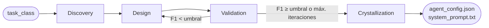

# StemAgent

**Un agente base que se especializa solo.** Recibe una clase de problemas, investiga cómo la abordan los expertos, diseña su propia configuración, se mide contra un benchmark y repite hasta que es lo bastante bueno. Entonces se "cristaliza" en un agente especializado y reutilizable.

Este proyecto responde a un reto planteado por JetBrains:

> *"Una célula madre no sabe en qué se convertirá. Interpreta señales de su entorno y se transforma [...] ¿Y si los agentes de IA funcionaran de la misma manera?"*

El dominio elegido para demostrarlo es **code review de Python**: es medible con precision, recall y F1, y hay estrategias de revisión de sobra que justifican una fase de investigación real.

## Cómo funciona

El agente es un grafo de estados de [LangGraph](https://github.com/langchain-ai/langgraph) con cuatro nodos y un bucle de mejora:



| Fase | Qué hace | Código |
|---|---|---|
| **Discovery** | Busca en la web (Tavily) cómo se hace code review y QA, y un LLM lo resume en 6-10 estrategias concretas. | `src/graph/nodes/discovery.py` |
| **Design** | Genera un `AgentConfig` (system prompt, herramientas y flujo de pasos) a partir de lo descubierto. Desde la segunda vuelta, usa las métricas y el prompt del intento anterior para corregirse. | `src/graph/nodes/design.py` |
| **Validation** | Ejecuta el agente candidato sobre el benchmark, calcula precision, recall y F1, y decide si vuelve a Design o si ha terminado. | `src/graph/nodes/validation.py` |
| **Crystallization** | Exporta el agente final a `data/outputs/latest/`. | `src/graph/nodes/crystallization.py` |

El "ADN" del agente es su system prompt: especializarse consiste en reescribirlo con evidencia (lo investigado y lo medido) en lugar de a ojo. El criterio de parada es objetivo: **F1 ≥ 0,70** o un máximo de iteraciones.

## Resultados

Benchmark propio de 37 fragmentos de Python con issues etiquetados a mano (lógica, seguridad, mantenibilidad, estilo, rendimiento y fiabilidad), en `data/benchmark/samples.jsonl`.

| Métrica | Baseline (prompt genérico) | StemAgent especializado |
|---|---|---|
| Precision | 0,108 | 0,788 |
| Recall | 0,541 | 0,703 |
| **F1** | **0,180** | **0,743** |

Las cifras del baseline están en `data/outputs/baseline_results.json`. Las del agente especializado, en `report/report.md`.

**Cómo leer estos resultados.** La mejora es real, pero no toda viene de "revisar mejor":
- El benchmark es pequeño y lo he creado yo, así que mide el encaje con estas etiquetas, no la calidad general de un revisor.
- Al agente especializado se le dan en el prompt las frases canónicas del benchmark, y sus predicciones se filtran a ese vocabulario (`src/evaluation/runner.py`). El baseline no tiene ese filtro: cualquier observación fuera de las etiquetas cuenta como falso positivo, y eso penaliza su precision.
- Durante el bucle, el umbral se comprueba con las 5 primeras muestras (`MAX_VALIDATION_SAMPLES`) para ahorrar llamadas. La evaluación final usa el benchmark completo.

## Puesta en marcha

Requisitos: Python 3.10+ y claves de API de OpenAI y Tavily.

```bash
git clone https://github.com/juanhdezz/stem-agent.git
cd stem-agent
python -m venv .venv && source .venv/bin/activate
pip install -r requirements.txt
cp .env.example .env   # y rellena OPENAI_API_KEY y TAVILY_API_KEY
```

```bash
# 1. Baseline: agente con prompt genérico (guarda data/outputs/baseline_results.json)
python scripts/run_baseline.py

# 2. Especialización completa: Discovery → Design ⇄ Validation → Crystallization
python scripts/run_stem_agent.py --task-class code_review

# 3. Evaluación del agente cristalizado sobre todo el benchmark, comparada con el baseline
python scripts/evaluate_final.py --config data/outputs/latest/agent_config.json
```

Sin clave de Tavily, Discovery sigue funcionando con lo que sabe el LLM. Todas las llamadas usan `gpt-4o-mini`.

### Variables de entorno

| Variable | Por defecto | Para qué sirve |
|---|---|---|
| `OPENAI_API_KEY` | | LLM de todas las fases |
| `TAVILY_API_KEY` | | Búsqueda web en Discovery (opcional) |
| `VALIDATION_THRESHOLD` | `0.70` | F1 mínimo para cristalizar |
| `MAX_ITERATIONS` | `5` | Vueltas máximas de Design ⇄ Validation |
| `MAX_VALIDATION_SAMPLES` | `5` | Muestras usadas dentro del bucle (`0` = todas) |
| `MAX_ISSUES_PER_SAMPLE` | `5` | Issues máximos por fragmento |
| `EVAL_DATASET_PATH` | `data/benchmark/samples.jsonl` | Benchmark a usar |

## Tests

```bash
pytest
```

Los tests simulan el LLM y la búsqueda web con mocks, así que no necesitan claves: cubren cada nodo y la ejecución completa del grafo.

## Estructura

```
src/
  graph/          grafo LangGraph: estado (state.py), construcción (graph.py) y un nodo por fase
  models/         AgentConfig, ToolSpec, FlowStep, EvalResult
  tools/          búsqueda web, análisis estático básico y generador de prompts
  evaluation/     carga del benchmark, métricas y runner del agente candidato
data/benchmark/   samples.jsonl y su descripción
scripts/          baseline, especialización y evaluación final
experiments/      notebooks del baseline y de la traza de evolución
tests/            tests de cada nodo y del grafo completo
report/           informe del proceso (también en stem_agent_report.pdf)
```

## Decisiones de diseño

- **Code review como dominio.** Se puede medir con métricas automáticas; deep research o seguridad son más difíciles de evaluar de forma objetiva.
- **LangGraph frente a CrewAI o AutoGen.** El bucle Validation → Design es una arista condicional explícita y el estado es tipado y auditable en cada paso. En un reto donde el proceso importa tanto como el resultado, esa transparencia es lo que se necesita.
- **Umbral fijo como criterio de parada.** "Cuando el agente crea que está listo" no se puede verificar. Un umbral hace el proceso reproducible y la comparación antes/después objetiva.

## Siguientes pasos

- Evaluar con un benchmark externo (por ejemplo, BugsInPy) para medir la generalización y no solo el encaje con mis etiquetas.
- Comparar con un baseline que use el mismo vocabulario de etiquetas, para aislar cuánto aporta la especialización.
- Añadir un nivel de confianza por issue para reducir falsos positivos.
- Probar clases de problemas distintas de QA (seguridad, rendimiento).

---

Desarrollado por [Juan Hernández Sánchez-Agesta](https://github.com/juanhdezz).
